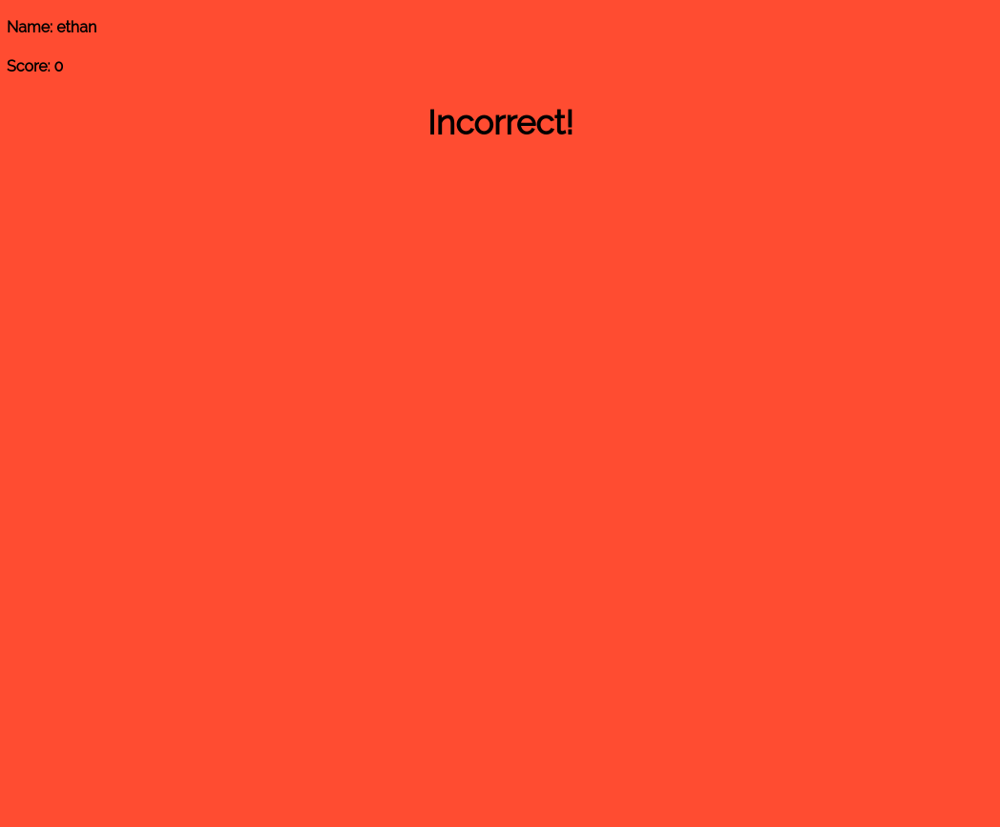

# Quizz Game
Este es un projecto basado en [kahoot-clone-nodejs](https://github.com/ethanbrimhall/kahoot-clone-nodejs "kahoot-clone-nodejs")

#### Diferencia:
- Se agrego persistencia a mongodb y se ejecuta usando docker-compose, sin necesidad de configuración de IP/PORT de conexión

##### Pasos previos:
- Instalar docker y docker-compose

##### Pasos a seguir:
`$ git clone https://github.com/candelim/quizz-game.git`
`$ cd quizz-game`
`$ docker-compose up -d`

#### Capturas de pantalla

